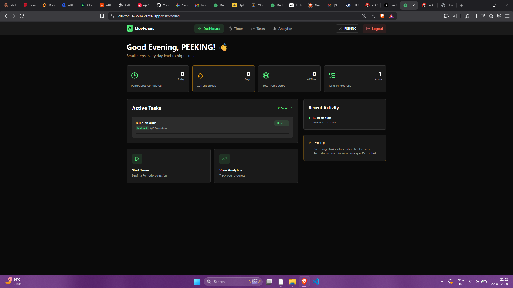
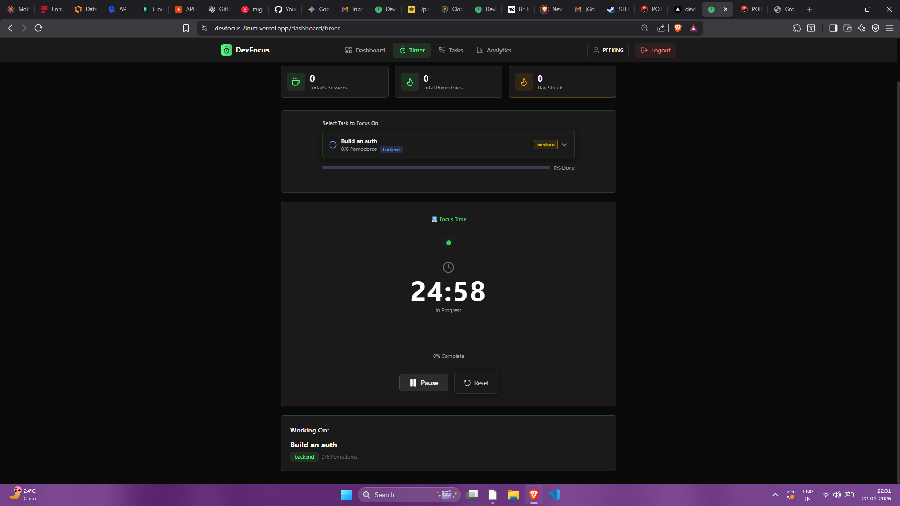
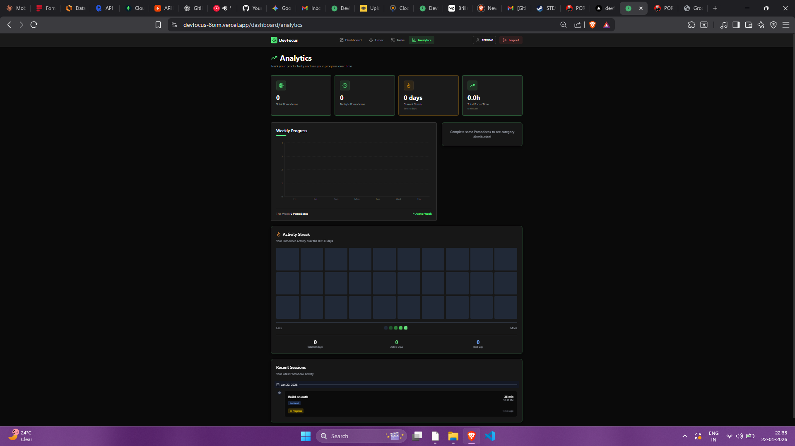
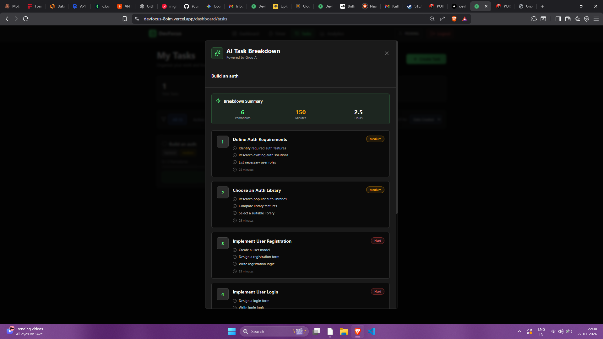

# 🎯 DevFocus - AI-Powered Pomodoro Timer for Developers

> **Focus better. Code faster. Ship more.**

DevFocus is a full-stack productivity app that combines the Pomodoro Technique with **AI-powered task breakdown** to help developers stay focused and track coding sessions. Built with the **MERN stack** and integrated with **Groq AI**.

---

## 🔗 Live Demo
- **DevFocus:** https://devfocus-8oim.vercel.app 

## 🎥 Demo Video 
## COMING SOON

## 📸 Screenshots

> Put your screenshots in a folder like: `assets/`

Example:

---

## 🌟 Key Features

### 🤖 AI-Powered Task Breakdown
- **Groq AI Integration**: Breaks complex tasks into 4–6 focused Pomodoro sessions
- **Subtask + Steps**: Each Pomodoro includes clear steps and difficulty ratings
- **Context-aware Suggestions**: AI creates actionable 25-minute work blocks

### ⏱️ Pomodoro Timer
- Persistent timer state using localStorage
- Circular progress indicator
- Auto break mode + wellness suggestions
- Desktop notifications using Web Notifications API

### 📊 Analytics Dashboard
- Daily streak tracking + reset logic
- Weekly charts using Recharts
- Category distribution & time analytics
- Session history with notes + timestamps

### 🔐 Authentication
- Email OTP verification using SendGrid
- JWT authentication + protected routes
- Password reset flow using OTP

### 📝 Task Management
- Full CRUD tasks
- Priority + category labels
- Pomodoro progress tracking
- AI breakdown applied to tasks

